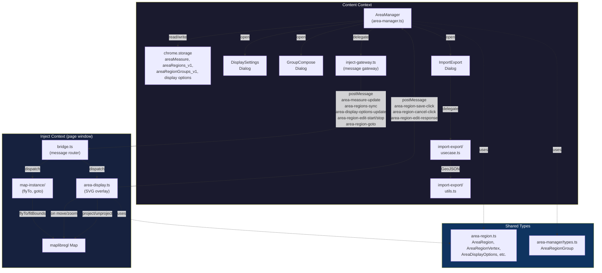
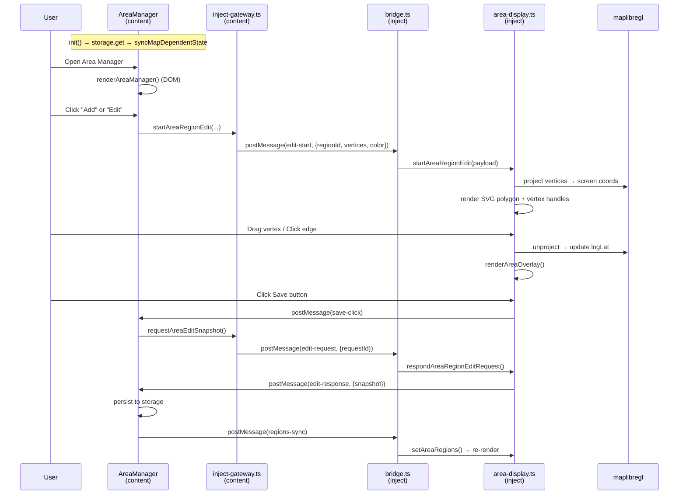

# Area Feature Knowledge

## Overview

エリア機能は、マップ上にユーザ定義のポリゴン領域を描画・管理する機能。
content側の `AreaManager` クラスがストレージ・状態管理・UIダイアログを担当し、
inject側の `area-display.ts` がマップ上のSVGオーバーレイ描画・頂点編集を担当する。

!!!codeの内容を変更/構造を変えた場合、このドキュメントも更新すること!!!

## Architecture

### Context Boundary

| 役割                              | Context | ファイル                                                       |
| --------------------------------- | ------- | -------------------------------------------------------------- |
| 状態管理・永続化・UIダイアログ    | content | `src/features/area-manager/area-manager.ts`                    |
| 表示設定ダイアログ                | content | `src/features/area-manager/modules/display-settings/dialog.ts` |
| グループ合体ダイアログ            | content | `src/features/area-manager/modules/group/dialog.ts`            |
| インポート/エクスポートダイアログ | content | `src/features/area-manager/modules/import-export/dialog.ts`    |
| インポート/エクスポート処理       | content | `src/features/area-manager/modules/import-export/usecase.ts`   |
| GeoJSON変換ユーティリティ         | content | `src/features/area-manager/modules/import-export/utils.ts`     |
| Content↔Inject通信ゲートウェイ    | content | `src/features/area-manager/modules/inject-gateway.ts`          |
| Areaメッセージ定数               | shared  | `src/constants/area-message.ts`                                |
| Area共通ユーティリティ            | shared  | `src/utils/area-region.ts`                                     |
| マップ上SVG描画・頂点編集         | inject  | `src/inject/features/area-display.ts`                          |
| メッセージルーティング            | inject  | `src/inject/bridge.ts`                                         |

### Types

- `src/types/area-region.ts` — 共有型定義
  - `AreaRegion`: id, name, color, vertices, visible, createdAt, updatedAt
  - `AreaRegionVertex`: { lng, lat }
  - `AreaRegionBounds`: { west, south, east, north }
  - `AreaRegionEditSnapshot`: { regionId, name, vertices }
  - `AreaNameDisplayMode`: "always" | "off" | "hide-on-zoom-out"
  - `AreaDisplayOptions`: { fillOpacityPercent, nameClickToGoto, nameDisplayMode }
- `src/features/area-manager/types.ts` — content側専用
  - `AreaRegionGroup`: { id, name, regionIds, createdAt, updatedAt }

## Content↔Inject Messaging Protocol

すべて `window.postMessage` による通信。`source` フィールドで識別。

### Content → Inject (一方向)

| source                                  | 用途               | payload                                                       |
| --------------------------------------- | ------------------ | ------------------------------------------------------------- |
| `mr-wplace-area-measure-update`         | エリア表示ON/OFF   | `{ visible: boolean }`                                        |
| `mr-wplace-area-regions-sync`           | 全リージョンの同期 | `{ regions: AreaRegion[] }`                                   |
| `mr-wplace-area-display-options-update` | 表示オプション変更 | `{ options: AreaDisplayOptions }`                             |
| `mr-wplace-area-region-edit-start`      | 編集モード開始     | `{ regionId, name, color, vertices, saveLabel, cancelLabel }` |
| `mr-wplace-area-region-edit-stop`       | 編集モード終了     | (なし)                                                        |
| `mr-wplace-area-region-goto`            | エリアへ移動       | `{ regionId, lng, lat, bounds? }`                             |

### Content → Inject (リクエスト/レスポンス)

| source (req)                         | source (res)                          | 用途                         |
| ------------------------------------ | ------------------------------------- | ---------------------------- |
| `mr-wplace-area-region-edit-request` | `mr-wplace-area-region-edit-response` | 編集中のスナップショット取得 |

### Inject → Content (一方向)

| source                               | 用途                 | トリガ                          |
| ------------------------------------ | -------------------- | ------------------------------- |
| `mr-wplace-area-region-save-click`   | 保存ボタン押下       | SVGオーバーレイ上のSaveボタン   |
| `mr-wplace-area-region-cancel-click` | キャンセルボタン押下 | SVGオーバーレイ上のCancelボタン |

## Storage Keys (chrome.storage)

| Key                                | Type                | Default  | 説明               |
| ---------------------------------- | ------------------- | -------- | ------------------ |
| `mapFilter_areaMeasure`            | boolean             | false    | エリア表示ON/OFF   |
| `areaRegions_v1`                   | AreaRegion[]        | []       | 全リージョンデータ |
| `areaRegionGroups_v1`              | AreaRegionGroup[]   | []       | グループデータ     |
| `mapFilter_areaSyncUrl`            | string              | ""       | オンライン同期URL  |
| `mapFilter_areaFillOpacityPercent` | number              | 14       | 塗り透明度(0-100)  |
| `mapFilter_areaNameClickToGoto`    | boolean             | true     | 名前クリックで移動 |
| `mapFilter_areaNameDisplayMode`    | AreaNameDisplayMode | "always" | 名前表示モード     |

## Content側: AreaManager クラス

### 初期化フロー

1. `init()` でストレージから全設定をロード
2. `mapReady` 判定 → ready なら `syncMapDependentState()` で inject に通知
3. `bindAreaManagerMessageHandlers()` で save/cancel クリックと map-ready を監視

### 主要メソッド

- `setAreaMeasureEnabled(enabled)` — ON/OFF切替、ストレージ保存、inject通知
- `openAreaManager()` — モーダルを生成・表示
- `startAreaEditing(regionId, closeModal)` — 編集モード開始、inject に `edit-start` 送信
- `stopAreaEditing(skipRender)` — 編集モード終了、inject に `edit-stop` 送信
- `saveAreaEditing()` — inject に snapshot リクエスト → 応答を受けて保存
- `renderAreaManager()` — モーダル内のリージョン/グループ一覧をDOM生成

### データフロー (保存時の例)

1. Save ボタン click → inject が `mr-wplace-area-region-save-click` を postMessage
2. content の `saveAreaEditing()` が起動
3. `requestAreaEditSnapshot()` で inject に `edit-request` 送信
4. inject が `respondAreaRegionEditRequest()` で `edit-response` 返送
5. content が vertices を受取り、storage に保存、`notifyAreaRegions()` で inject に regions 同期

### グループ機能

- 複数リージョンを1つのグループにまとめる
- グループ内リージョンは同名・同色に統一
- グループ解除は regionIds を解除するだけ (リージョン自体は残る)
- `cleanupAreaRegionGroups()` で不整合なグループを自動除去

### インポート/エクスポート

- GeoJSON (FeatureCollection) 形式で入出力
- `mrWplaceAreaGroups` カスタムフィールドでグループも保存
- merge: 既存とIDベースでマージ / replace: 全置換
- URL同期: fetchしたJSONをインポート

## Inject側: area-display.ts

### 描画構造 (DOM)

```
div#mr-wplace-area-measure (container, pointer-events: none)
├── svg (viewBox=マップサイズ)
│   ├── g (regionsLayer: 確定リージョンポリゴン群)
│   └── polygon (editPolygon: 編集中ポリゴン)
├── div (edgeHitLayer: エッジクリック用透明hit領域)
├── div (regionLabelLayer: 確定リージョン名ラベル群)
├── div (areaLabel: 編集中の面積表示)
└── div (editActionLayer: Save/Cancelボタン)
    ├── button (Save)
    └── button (Cancel)
```

### 描画フロー

1. `addAreaOverlay(map)` — コンテナ生成、マップイベント(move/zoom/rotate/pitch/resize)にバインド
2. `renderAreaOverlay(map)` — 毎フレーム的に呼ばれる中心関数
   - SVG viewBox をマップコンテナサイズに合わせる
   - 確定リージョン: `createRegionPolygon()` でSVGポリゴン生成 + ラベル生成
   - 編集モード: 頂点をスクリーン座標に投影、ドラッグハンドル配置、エッジhit領域配置

### 頂点編集

- 頂点ドラッグ: `startVertexDrag()` → `pointerMove` でリアルタイム更新 → `stopVertexDrag()`
- 頂点追加: エッジ(辺)をクリック → `insertVertexOnEdge()` で中点挿入
- 頂点削除: 頂点をダブルクリック (3頂点以下にはならない)
- ドラッグ中はマップの `dragPan` を無効化

### Export されている関数

- `setAreaMeasureEnabled(enabled)` — オーバーレイの表示/非表示
- `setAreaRegions(regions)` — 確定リージョン一覧を更新、再描画
- `setAreaDisplayOptions(options)` — 透明度・名前表示モード変更、再描画
- `startAreaRegionEdit(payload)` — 編集モード開始
- `stopAreaRegionEdit()` — 編集モード終了
- `respondAreaRegionEditRequest(data)` — 編集スナップショット応答
- `setupAreaMeasureOnMapReady(mapInstance)` — マップ ready 時のセットアップ

### 面積計算

- `calculateGeodesicAreaSquareMeters(vertices)` — 測地線面積 (m²)
- `calculatePixelAreaSquare(vertices)` — ピクセル面積 (px²)
- 両方とも `@/utils/coordinate` からインポート

## Coding Notes

### 新しいエリア設定を追加する場合

1. `src/types/area-region.ts` に型追加 (必要に応じて)
2. `AreaManager` に storage key、デフォルト値、normalize メソッド追加
3. `init()` の `storage.get()` に key 追加
4. `notifyAreaDisplayOptions()` (または個別メッセージ) で inject に通知
5. `area-display.ts` 側で受信・適用・再描画
6. `bridge.ts` のルーティングは既存パターンに従う

### 注意点

- inject 側は `chrome.storage` を使えない → content が storage 管理
- inject 側のモジュール変数 (let) で状態を保持 (クラスではない)
- `renderAreaOverlay()` はマップイベントごとに呼ばれるため軽量に保つ
- 色は `#rrggbb` 6桁hex のみ対応 (`normalizeAreaColor` で検証)
- リージョンは `updatedAt` 降順でソート
- Content↔Inject の area message source は `src/constants/area-message.ts` を使って定義を一元化する
- AreaManager から直接 `window.postMessage` を呼ぶより `modules/inject-gateway.ts` 経由を優先する

## Refactor Worklog (Handover)

### 2026-02-18 Phase 1 (完了)

- 目的: 重複ロジックとメッセージ文字列散在を削減
- 実施:
  - `src/constants/area-message.ts` を追加して area message source を一元化
  - `src/utils/area-region.ts` を追加して color/name-mode/bounds/pixel-area を共通化
  - `area-manager.ts`, `area-display.ts`, `bridge.ts` に適用
- 結果:
  - 文字列タイポリスク低減
  - content/inject 間の仕様変更追従コストを削減

### 2026-02-18 Phase 2 (完了)

- 目的: `AreaManager` の責務から通信境界を分離
- 実施:
  - `src/features/area-manager/modules/inject-gateway.ts` を追加
  - 以下を `AreaManager` から gateway へ移動:
    - map-ready/save/cancel の message listener バインド
    - measure/regions/display-options/goto/edit-start/edit-stop の postMessage 送信
    - edit snapshot request/response (timeout付き)
  - `AreaManager` 側は gateway 呼び出しに置換
- 結果:
  - `AreaManager` の通信詳細依存を縮小
  - 通信仕様変更時の変更点を gateway に集約可能

### Review Result

- 実行確認: `npm run build` 成功
- 挙動回帰リスク(低):
  - listener は `init()` 再実行時に重複登録されないようガード済み
  - 既存 message source と payload 形は維持
- 未対応/次フェーズ候補:
  - `renderAreaManager()` の巨大化 (UI構築責務分割)
  - `renderAreaOverlay()` の全再生成コスト最適化 (差分更新 / rAF間引き)
  - map-ready source (`mr-wplace-map-instance-captured`) も将来的に定数化候補

## Mermaid Diagram




