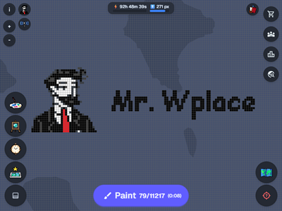

# Mr. Wplace

[English](README.md) | **日本語**

マップタイル上での高度な画像描画と管理機能を提供する、WPlaceサイト向けの強力なChrome拡張機能です。

公式サイト: [https://c20-40a.github.io/mr-wplace/](https://c20-40a.github.io/mr-wplace/)

## 🚀 インストール

### ユーザー向け

#### デスクトップ

公式ストアからMr. Wplaceを入手してください：

- **Chrome Web Store**: [Google Chrome 向けにインストール](https://chromewebstore.google.com/detail/mr-wplace/klbcmpogekmdckegggoapdjjlehonnej?hl=ja)
- **Microsoft Edge Add-ons**: [Edge 向けにインストール](https://microsoftedge.microsoft.com/addons/detail/mr-wplace/acdodonamhbokadiikkfnnliplijigip)
- **Firefox Add-ons**: [Firefox 向けにインストール](https://addons.mozilla.org/ja/firefox/addon/mr-wplace/)

#### モバイル

**Android**

- **Edge Canary**: Edge Canary アプリをインストールし、[Edge Add-ons](https://microsoftedge.microsoft.com/addons/detail/mr-wplace/acdodonamhbokadiikkfnnliplijigip) にアクセスして自動インストールします
- **Firefox Nightly**: Firefox Nightly for Developers アプリをインストールし、[Firefox Add-ons](https://addons.mozilla.org/ja/firefox/addon/mr-wplace) にアクセスしてワンクリックでインストールします

**iOS (Orion Browser)**

1. App Store から [Orion Browser by Kagi](https://apps.apple.com/app/orion-browser-by-kagi/id1484498200) をダウンロードします
2. Orion を開く → 設定 → 詳細 → 「Chrome拡張機能」および「Firefox拡張機能」を有効にします
3. [Chrome Web Store](https://chromewebstore.google.com/detail/mr-wplace/klbcmpogekmdckegggoapdjjlehonnej) から拡張機能をインストールします

### 開発者向け

ソースからのビルドや貢献に興味がありますか？以下のトピックについては [Contributing Guide](CONTRIBUTING.md) をご確認ください：

- 開発環境のセットアップ
- ビルドとリリースのコマンド
- コーディングガイドラインとアーキテクチャの概要
- i18n（国際化）ワークフロー

## 機能

### 🖼️ ギャラリーと画像管理

- サムネイル付きでテンプレート画像のアップロード、編集、管理
- ドラッグ＆ドロップで並べ替え可能なレイヤーベースの画像管理
- 画像編集機能：明るさ、コントラスト、彩度、シャープネス、ディザリング
- 複数のディザリングアルゴリズム（Bayerマトリックス）を利用した色変換
- バックアップとデバイス移行のためのギャラリーのZIP形式でのインポート/エクスポート
- Skirk Marble テンプレート JSON インポートのサポート
- 残りピクセル数と予想完了時間による進捗追跡

### 🎨 高度な描画ツール

- オーバーレイレンダリングを使用してマップタイルに画像やテキストを描画
- 5つのピクセルフォント対応（カスタム日本語フォントを含む）
- ピクセル数表示付きのカラーパレット
- モバイルでの描画に便利なパレットの表示/非表示切り替え
- 4つの強化された描画モード：巨大な赤い十字、巨大な赤い十字（太字）、巨大な赤いダイヤ、巨大な赤いリング
- 「未配置のみ表示」モード：未塗装のピクセルを灰色でハイライト
- 「色分離」モード：選択した色のみを自動的に表示

### ⏱️ タイムトラベル

- ロールバック保護のためのタイル・スナップショットの保存と復元
- 座標とタイムスタンプ付きでタイルを共有
- 隣接するアーカイブされたタイルを1つの画像に結合

### 🎨 カラーフィルターと視覚支援

- WPlaceのカラーパレットに合わせたカラーフィルターの適用
- 複数の描画モードの視覚化
- 視認性を高めるハイコントラストモード
- タイルの境界線表示

### 📍 ブックマークとナビゲーション

- タグ付きでお気に入りの場所を保存（作成、編集、タグによるフィルタリング）
- タグごとのブックマークのエクスポート/インポート
- 場所名で検索し、指定した座標へのジャンプ
- 緯度経度とWPlace座標の相互変換

### 🌓 テーマと表示

- マップとUIのダークテーマ
- ハイコントラストモード
- 互換性のためのGPU/CPUレンダリングモードの切り替え

### 💾 データセーバーモード

- LRU (Least Recently Used) 方式によるオフラインタイルキャッシュ
- 設定可能なキャッシュサイズ制限
- ストレージ使用量の監視
- 帯域幅の削減とパフォーマンスの向上

### 📊 統計と分析

- ユーザーごとのペイント統計
- 色ごとの内訳付き、タイルあたりの色統計
- タイルごとの色統計 (一致/合計)
- 複数の画像にわたる集約された統計

### 🔔 通知

- ペイントが蓄積したときに通知を受け取る（10%から100%までカスタマイズ可能なパラメータ）
- オプションでのGoogleカレンダーリンク連携
- ポップアップから通知のオン/オフ設定

### 👥 フレンドブック

- 他のプレイヤーの情報をタグ付きで保存
- プレイヤーごとにメモを追加
- プレイヤーリストのCSV形式でのインポート/エクスポート
- マウスホバーでプレイヤーのメモを表示

### 🛠️ 開発者モード

- 開発者モードを有効にするための10クリックのイースターエッグ（またはコナミコマンド）

## 📄 ライセンス

Mozilla Public License 2.0

## 🔗 関連リンク

- [WPlace 公式サイト](https://wplace.live/)
- [Wplace - 行動規範](https://wplace.live/terms/code-of-conduct)
